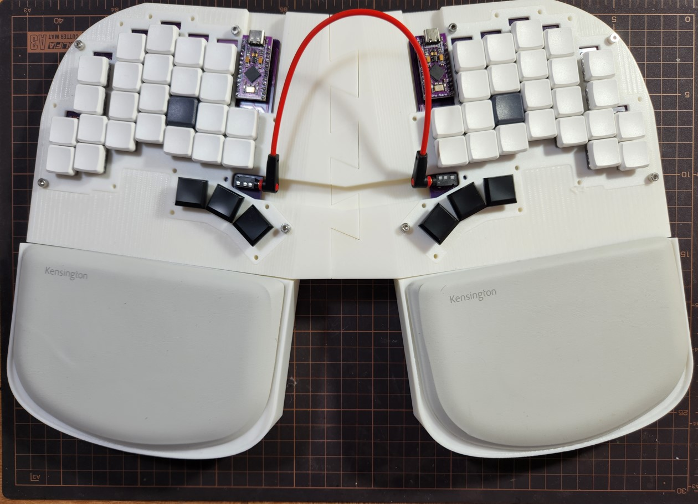

# OAK Keboard
54 keys split keyboard with large column stagger. This is my personal keyboard made with my hands and specifications in 
mind. After using publicly available keyboards for a while I had a list of requirement I wanted for my dream keyboard. I went and made it 
my self.

## Specs
* Revisable board split keyboard.
* Support the pro micro platform.
* Include a number row.
* Fit my hand vertical stagger (L size gloves).
* Horizontal line stagger for pinky - I have a hard time with linear pinky line. I need it to flair outward.
* 3 Thumb buttons

## Reasons of Develpment

## Software
Layout: Ergogen 3  
PCB Routing: KiCad  
Printable 3D models: Fusion 360  
Firmware: Fork of the QMK project: https://github.com/ofekazar/oak_firmware  
